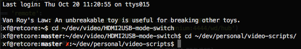

## traditional-plus zsh theme

Single-line boring/traditional prompt without distracting colours, providing extra information (currently git branch/status).

## Installation

For oh-my-zsh users, place into ~/.oh-my-zsh/custom/themes and change ZSH_THEME in your ~/.zshrc

## Contact

Ryan Verner <ryan.verner@gmail.com>

